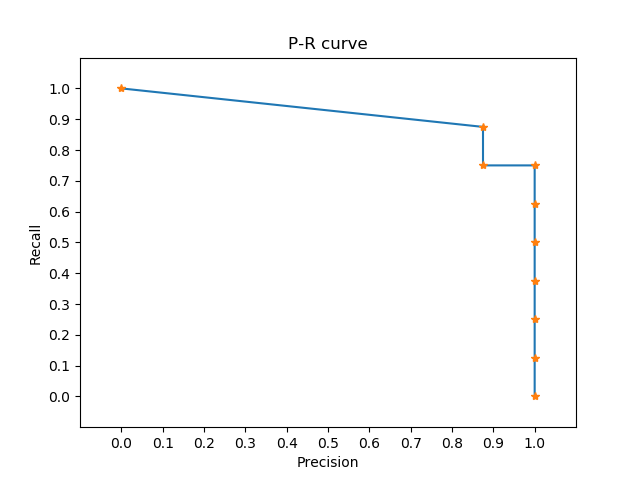

# 目标检测的mAP指标计算

​	   在评估目标检测算法的性能时，我们经常使用Pascal VOC比赛的“mAP”来作为衡量的标准。虽然目前有一些Python、Matlab或C 的API工具可以自动计算，但是对于每个学习者来说，详细了解这个评价指标的具体计算过程并自己编程实现一遍是非常有益的，尤其是对于新手而言。

## 原理介绍

### IoU

​	   IoU简单来说就是交并比，用来衡量单个目标检测结果的性能。如下图所示，假定该图中的检测小狗的真实标签是红框，由左上角的点(xmin_1，ymin_1) 和右下角的点(xmax_1, ymax_1)来表示，检测的结果是白框，由左上角的点 (xmin_2，ymin_2) 和右下角的点 (xmax_2, ymax_2)表示，浅绿色的区域是红白框相交的区域，那么IoU可以通过如下的方式进行计算：

$$
S_1 = (xmax_1-xmin_1+1)\times(ymax_1-ymin_1+1) \\
S_2 = (xmax_2-xmin_2+1)\times(ymax_2-ymin_2+1)\\
Intersec = (xmax_2-xmin_1+1)\times(ymax_2-ymin_2+1)\\
IoU = \frac{Intersec}{S_1+S_2-Intersec}
$$


​	   通常而言，IoU的值越高，认为检测的结果越好。当检测结果和真实标签完全对上时，IoU就是1，反之当检测结果和真实标签没有一点交集时，IoU为0，其他情况下IoU的计算就是两个框的交并比。通常情况下设定当IoU超过一个给定的阈值时， 检测为正确，在Pascal VOC竞赛中，这个值是0.5。

### P-R曲线

​	   上面提到的IoU是用来评价单个目标检测结果的好坏程度，但并不适合多目标检测，原因是我们事先并不知道一张图片中有多少目标 ，多目标检测可能存在漏检或检测目标个数超过实际存在个数的情况。因此，针对多目标检测要用其他更有效的评价指标——精度(precision)和召回率(recall)。

#### TP,TN,FP和FN

​	   在讨论精度和召回率之前，我们先要了解四个名词: TP, TN, FP and FN，它们通常是用在信息检索领域，但应用在目标检测的性能指标评价也是很有效的。 如下图所示，一张图片中存在若干正样本和负样本，目标检测的结果我们都认为是正样本。 TP是True Positive，它指的是检测结果中和真实标签对比确实是正样本的部分；FP是False Positive，它指的是检测器认为是正样本，但其实是负样本的部分；FN是False Negative，指的是所有真实标签的正样本中漏检的那一部分，TN是True Negative，指的是被认为是负样本并且的确是负样本的部分。

​	   这四个概念之前是用在了信息检索领域，放到目标检测的性能评价这块需要稍稍修正一下理解，在目标检测领域没有对负样本进行标定，因为除了正确的检测框，其他地方可以画出几乎无数的不包含任何目标的负样本框，所以说TP，FP和FN是可以计算得到的。


#### Precision和Recall

​	   了解了上述四个概念，下面开始讲精度(precision)和召回率(recall)，精度指的是检测结果中，正确样本数量占整个检测样本数量的比例 ，描述的是“查准率”，召回率指的是检测结果中正确样本数量占整个真实标签样本的数量，描述是”查全率“，可以通过如下方式计算：
$$
precision = \frac{TP}{TP+FP},recall = \frac{TP}{TP+FN}
$$
​	   然而精度和召回率的单个指标是不能拿来很好地评价多目标检测的，因为存在一些极端情况。举个栗子，某张图片中存在十个待检测目标，检测算法只检测到一个目标，并且检测正确，那么它的精度就是100%，但实际上它的性能并不好，因为它不能检测到其他九个正确的目标，召回率是10%，即高精度低召回率；还有一种情况，检测算法检测到了100个框，真实标签的十个目标也全都检测正确，那么它的召回率是100%,但是它的精度只有10%，即高召回率低精度，那么说精度和召回率一定是此消彼长的关系吗？ 其实并不是，这两个只是举的计算的例子，只是说明光看一个指标会受到蒙蔽，只有精度和召回率同时高才是我们想要的，最好的情况就是检测到了十个目标，这十个正好是真实标签的十个目标，那么它的精度就是100%，召回率也是100%。

#### P-R曲线

​	   但有个问题是，精度(precision)和召回率(recall)是由TP, FP和FN来计算得到的，每张图片的每个类别都有自己的一个TP, FP和FN，如果计算的话每张图片的每个类别都有自己的一个precision和recall，但由于图片与图片之间单个类别的目标数量不同且少，检测难易差异比较大，算到的结果会高度离散化(大部分图片由于不存在目标计算结果会是0)，直接平均计算，并不能很好地表示本张图片该类别的检测好坏程度。我们先谈怎么评价所有图片中针对一个类别的检测性能，这里又涉及到另一个概念——置信度confidence，即检测算法输出时针对每个检测结果都会给一个置信度评分(0-1)，表明算法认为有多大的把握检测正确。不同的图片即使检测到了同一个目标，置信度也很有可能不一样

​	   那我们会想为什么不将所有图片单个类别的TP,FP和FN加起来，计算得出一个precision和recall值，因为这样做太粗爆了。就跟上面说的图片与图片之间单个类别的目标数量不同且少，检测难易差异比较大，这个难易差异直接体现在precision和recall的计算上，也体现在置信度confidence上。

​	所以为了更准确地做出评价，我们可以直接根据置信度的分数对所有图片的检测结果进行一个从大到小的排序，并对TP,FP和FN进行累加，每个confidence下都可以得到一组TP，FP和FN，从而得到每种检测难度下的一个precision和recall值，把得到的所有precision和recall值在一个二维坐标上画出来，即得到P-R曲线。

#### AP和mAP

​	   这个曲线与坐标轴围成的面积即该类别的AP值(Average Precision)，用来评价所有图片中单个类别的检测结果，这个计算方式相比用一组precision和recall值的评价显然更公平一些。mAP是mean Average Precision的缩写，指的是对所有类别的AP值直接做均值计算。目前采用的都是暴力直接求均值，但其实不同类别的检测难度也会因为尺寸，目标数量占比等因素不一样，这个在一些比赛中是有相应的设置的，我们后面的计算只按照普通均值的方式计算来演示。

## 编程实现

### 准备数据

```
|--data
|  |--predictions
|  |  |--2007_000027.txt
|  |  |--......
|  |  |--2007_001416.txt
|  |--ground_truth
|  |  |--2007_000027.txt
|  |  |--......
|  |  |--2007_001416.txt
|  |--images
|  |  |--2007_000027.jpg
|  |  |--......
|  |  |--2007_001416.jpg
```

​	   这个数据是网上找的多目标检测测试结果，总共85张图，真实标签、检测结果和图片分辨存放在不同文件夹中，通过相同文件名来进行一一对应，如对于2007_000027来说，它的检测结果为predictions /2007_000027.txt它的真实标签为ground_truth/2007_000027.txt，图片的路径是images/2007_000027.jpg。

​	   检测结果txt的每一行内容是一个检测结果，包括类别，置信度和四个坐标信息，由空格隔开，如下所示：

```
class1 confidence1 xmin1 ymin1 xmax1 ymax1
class2 confidence2 xmin2 ymin2 xmax2 ymax2
......
classN confidenceN xminN yminN xmaxN ymaxN
```

​	   真实标签txt和上面相似，每一行内容为一个检测结果，包括类别和四个坐标信息，由空格隔开，如下所示：

```
class1 xmin1 ymin1 xmax1 ymax1
class2 xmin2 ymin2 xmax2 ymax2
......
classN xminN yminN xmaxN ymaxN
```

### 解析和处理数据

​	   由于后续是针对某个类别在所有图片中的计算，所以首先需要将所有图片的结果汇集起来，按类别进行存储，内部按照confidence进行排序，由于要保存image_id, bbox, confidence，所以用json格式来存储再合适不过了。如bed.json文件内容如下，整体是一个list，其中每个元素是一个字典类型，表示bed这个目标在哪张图像中被检测到，检测的bbox和置信度：

```
bed.json:
[{"confidence": 0.936491, "bbox": [1.0, 88.0, 599.0, 473.0], "image_id": "2007_000452"}, {"confidence": 0.930039, "bbox": [12.0, 91.0, 586.0, 467.0], "image_id": "2007_000837"}, {"confidence": 0.870608, "bbox": [0.0, 92.0, 442.0, 448.0], "image_id": "2007_000515"}, {"confidence": 0.848061, "bbox": [5.0, 96.0, 478.0, 456.0], "image_id": "2007_000799"}, {"confidence": 0.710099, "bbox": [19.0, 90.0, 143.0, 182.0], "image_id": "2007_000123"}, {"confidence": 0.43821, "bbox": [0.0, 78.0, 140.0, 184.0], "image_id": "2007_000645"}, {"confidence": 0.363359, "bbox": [1.0, 63.0, 133.0, 215.0], "image_id": "2007_000123"}, {"confidence": 0.263161, "bbox": [33.0, 57.0, 117.0, 194.0], "image_id": "2007_000636"}]
```

​	   然后为了计算的方便，我们要对每张图片的groundtruth也保存为相应的.json文件，保存的内容有category, bbox和detected(是否被检测过，防止重复检测)，内容如下：

```
2007_000027_ground_truth.json
[{"detected": 0, "bbox": [176.0, 206.0, 225.0, 266.0], "category": "pictureframe"}, {"detected": 0, "bbox": [170.0, 156.0, 350.0, 240.0], "category": "heater"}, 
{"detected": 0, "bbox": [272.0, 190.0, 316.0, 259.0], "category": "pottedplant"}, {"detected": 0, "bbox": [439.0, 157.0, 556.0, 241.0], "category": "book"},
{"detected": 0, "bbox": [437.0, 246.0, 518.0, 351.0], "category": "book"}, 
{"detected": 0, "bbox": [515.0, 306.0, 595.0, 375.0], "category": "book"},
{"detected": 0, "bbox": [407.0, 386.0, 531.0, 476.0], "category": "book"}, 
{"detected": 0, "bbox": [544.0, 419.0, 621.0, 476.0], "category": "book"},
{"detected": 0, "bbox": [609.0, 297.0, 636.0, 392.0], "category": "book"},
{"detected": 0, "bbox": [172.0, 251.0, 406.0, 476.0], "category": "coffeetable"}, {"detected": 0, "bbox": [2.0, 236.0, 102.0, 395.0], "category": "coffeetable"}, {"detected": 0, "bbox": [2.0, 10.0, 173.0, 238.0], "category": "tvmonitor"},
{"detected": 0, "bbox": [395.0, 2.0, 639.0, 470.0], "category": "bookcase"}, 
{"detected": 0, "bbox": [482.0, 83.0, 515.0, 107.0], "category": "doll"},
{"detected": 0, "bbox": [276.0, 233.0, 304.0, 259.0], "category": "vase"}]
```

### 计算TP和FP

​	    接着，我们就开始计算我们的指标TP和FP了，由于TP+FN的总和是正样本的数量，在上一步数据处理时就可以统计得到每个类别下的ground truth的数量。具体计算过程是这样的，针对每个类别.json文件，内容都是按照confidence从大到小排序的，针对每个目标，我们都需要找到对应图片的ground truth，然后计算该图片中相同类别的bbox和检测到的bbox的IoU，如果大于预先给定的阈值0.5，则将该框对应的'detected'改成1，并存回去，防止多次重复检测，该次检测的tp=1,fp=0，否则tp=0,fp=1，每个类别下的每个检测结果都对应一个tp和fp对，且和为1，每个类别tp和fp的数组长度跟检测到的框的数量相关，如上面的bed.json，数组长度就是8,而ground truth统计到的bed数也是8。接着可以按照如下公式计算每个confidence的阈值下对应的Precision和Recall:
$$
Precision_i = \frac{Acc TP}{AccFP+AccTP},Recall_i =  \frac{AccTP}{\sum{GT_{bed}}}
$$
​	中间的计算结果如下所示：

|  image_id   | confidence |  TP  | FP   | 累加的TP | 累加的FP |     Precision      | Recall |
| :---------: | :--------: | :--: | ---- | :------: | :------: | :----------------: | :----: |
| 2007_000452 |  0.936491  |  1   | 0    |    1     |    0     |        1.0         | 0.125  |
| 2007_000837 |  0.930039  |  1   | 0    |    2     |    0     |        1.0         |  0.25  |
| 2007_000515 |  0.870608  |  1   | 0    |    3     |    0     |        1.0         | 0.375  |
| 2007_000799 |  0.848061  |  1   | 0    |    4     |    0     |        1.0         |  0.5   |
| 2007_000123 |  0.710099  |  1   | 0    |    5     |    0     |        1.0         | 0.625  |
| 2007_000645 |  0.43821   |  1   | 0    |    6     |    0     |        1.0         |  0.75  |
| 2007_000123 |  0.363359  |  0   | 1    |    6     |    1     | 0.8571428571428571 |  0.75  |
| 2007_000636 |  0.263161  |  1   | 0    |    7     |    0     |       0.875        | 0.875  |

### 计算每个类别的AP

​	    我们本次计算AP的方式是按照Pascal VOC 2012的标准写的，如下所示：

```
def voc_ap(rec, prec):
    rec.insert(0, 0.0) 
    rec.append(1.0) 
    mrec = rec[:]
    prec.insert(0, 0.0) 
    prec.append(0.0) 
    mpre = prec[:]
    for i in range(len(mpre)-2, -1, -1):
        mpre[i] = max(mpre[i], mpre[i+1])
    i_list = []
    for i in range(1, len(mrec)):
        if mrec[i] != mrec[i-1]:
            i_list.append(i)
    ap = 0.0
    for i in i_list:
        ap += ((mrec[i]-mrec[i-1])*mpre[i])
    return ap, mrec, mpre
```

​      来解读一下这是怎么个计算过程，首先输入上一步计算好的precision和recall列表，如

```
Example: bed
precision = [1.0, 1.0, 1.0, 1.0, 1.0, 1.0, 0.8571428571428571, 0.875]
recall = [0.125, 0.25, 0.375, 0.5, 0.625, 0.75, 0.75, 0.875]
```

​	首先在recall的首部加0，尾部加1，precision的首尾都加0

```
Example: bed
precision = [0，1.0, 1.0, 1.0, 1.0, 1.0, 1.0, 0.8571428571428571, 0.875，0]
recall = [0，0.125, 0.25, 0.375, 0.5, 0.625, 0.75, 0.75, 0.875，1]
```

然后对precision执行：

```
for i in range(len(mpre)-2, -1, -1):
        mpre[i] = max(mpre[i], mpre[i+1])
```

让precision的列表单调递减，得到

```
mprec = [1.0, 1.0, 1.0, 1.0, 1.0, 1.0, 1.0, 0.875，0.875, 0]
```

对recall执行

```
for i in range(1, len(mrec)):
        if mrec[i] != mrec[i-1]:
            i_list.append(i)
```

记录recall列表中的突变点的索引

```
i_list= [1, 2, 3, 4, 5, 6, 8, 9]
```

此时可以画一下P-R曲线：



最后计算这个面积：

```
ap = 0.0
    for i in i_list:
        ap += ((mrec[i]-mrec[i-1])*mpre[i])
```

### 参考文献

- https://github.com/Cartucho/mAP
- http://host.robots.ox.ac.uk/pascal/VOC/